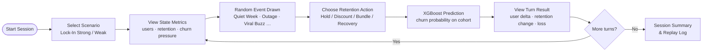
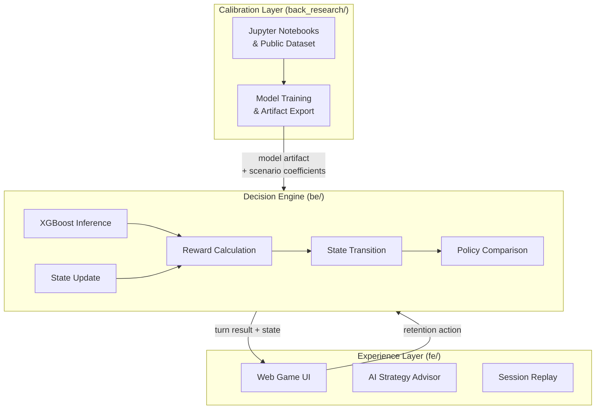

<div align="center">

# CEO Business Decision Simulator

> Play as the CEO of a SaaS company. Choose retention strategies each turn, trigger random market events, and let an XGBoost model predict the business outcome in real time.

<div>


</div>
</div>

---

## 📌 Overview

**CEO Business Decision Simulator** is a turn-based strategy game where you step into the role of a SaaS company CEO. Each turn you read live business metrics, respond to a random market event, and choose a retention action. A trained XGBoost churn model runs inference on every decision and feeds the result back into the game state — so every choice has measurable, data-driven consequences.

The project was built as the 2nd team project of **SKNetworks Family AI Camp (SKN28), Team 4**, combining full-stack web development with applied machine learning.

---

## ✨ Features

| # | Feature | Description |
|---|---------|-------------|
| 1 | **Turn-based CEO gameplay** | Up to 8 turns per session; each turn presents live state metrics and asks for a retention decision |
| 2 | **XGBoost churn inference** | Backend runs `predict_proba` against a real customer cohort on every turn to compute churn probability |
| 3 | **Random event engine** | Each turn draws a weighted market event (Quiet Week, Competitor Discount, Service Outage, Viral Buzz) that modifies state before your action resolves |
| 4 | **Scenario swap** | Two pre-built scenarios (`lockin_strong_saas`, `lockin_weak_saas`) change initial state, action catalog, and transition coefficients without touching engine code |
| 5 | **Policy comparison** | After each turn your choice is benchmarked against heuristic, lookahead-optimal, and shadow reference policies |
| 6 | **AI strategy advisor** | LLM assistant (OpenRouter-backed) reads the active incident and projected user loss, then gives concise, action-oriented guidance |
| 7 | **Session replay** | Full game log available for post-session review and analysis |
| 8 | **Result visualization** | Recharts-powered dashboard shows user delta, retention score, and churn probability across all turns |

---

## 🛠 Tech Stack

| Layer | Technology |
|-------|-----------|
| Frontend | React 19, Vite 8, TypeScript 6, Tailwind CSS v4, shadcn/ui, Recharts, Zustand, Vercel AI SDK |
| Backend | FastAPI, Python 3.12, Uvicorn, pandas, imbalanced-learn |
| ML | XGBoost (live inference), CatBoost (research), scikit-learn |
| Tooling | uv, bun 1.3, Ruff, pytest |

---

## 📁 Project Structure

```text
.
├── fe/                  # Frontend — Vite + React 19 + TypeScript
│   └── src/
│       ├── app/         # Route-level pages
│       ├── components/  # Shared UI components
│       ├── features/    # Feature modules (simulator, advisor, replay …)
│       ├── stores/      # Zustand global state
│       ├── shared/      # Utilities, types, API clients
│       └── lib/         # shadcn/ui helpers
├── be/                  # Backend — FastAPI + Python 3.12
│   └── src/be/
│       ├── app.py              # FastAPI entrypoint
│       ├── prediction.py       # Session store, event sampling, live XGBoost inference
│       ├── business_model.py   # Cohort feature composition and loss translation
│       ├── schemas.py          # Request/response and simulator contracts
│       └── settings.py         # Runtime settings
├── back_research/       # Research workspace — churn modeling, notebooks, artifacts
│   ├── myungbin/        # XGBoost churn model (artifact used by be/ at runtime)
│   ├── aprkapxkf/
│   ├── wonbeenlee/
│   ├── youn/
│   └── 전하영/
├── scenarios/           # Scenario definitions (JSON)
│   ├── lockin_strong_saas.json
│   └── lockin_weak_saas.json
└── docs/                # Architecture docs and PRDs
    ├── prds/
    └── project_specific/
```

---

## 🚀 Getting Started

### Prerequisites

- Python 3.12+ and [uv](https://github.com/astral-sh/uv)
- Node.js and [bun](https://bun.sh) 1.3+

### Backend

```bash
cd be
cp .env.example .env        # fill in BE_LLM_API_KEY and other vars
uv sync
uv run be                   # starts FastAPI dev server with reload at :8000
```

### Frontend

```bash
cd fe
cp .env.example .env.local  # fill in VITE_LLM_API_KEY and other vars
bun install
bun dev                     # starts Vite dev server at http://localhost:5173
```

### Research Notebooks

```bash
cd back_research
uv sync
uv run jupyter lab
```

### Key Environment Variables

| Variable | Location | Purpose |
|----------|----------|---------|
| `BE_LLM_API_KEY` | `be/.env` | LLM API key for mock fallback detection |
| `BE_CORS_ORIGINS` | `be/.env` | Allowed frontend origin (default: `http://localhost:5173`) |
| `VITE_LLM_API_KEY` | `fe/.env.local` | OpenRouter API key for AI strategy advisor |
| `VITE_BACKEND_PROXY_TARGET` | `fe/.env.local` | Backend URL (default: `http://127.0.0.1:8000`) |

---

## 🔄 Usage Flow



---

## 🏗 Architecture



| Layer | Directory | Role |
|-------|-----------|------|
| Experience | `fe/` | Web interface — game turns, charts, AI advisor, replay |
| Decision Engine | `be/` | State transition, reward, churn inference, policy comparison |
| Calibration | `back_research/` | Offline churn modeling; exports artifact loaded by `be/` at runtime |

### API Endpoints (`be/`)

| Endpoint | Description |
|----------|-------------|
| `GET /health` | Health check |
| `GET /api/system/architecture` | Runtime architecture info |
| `POST /api/prediction/session/start` | Start a new game session |
| `POST /api/prediction/churn` | Resolve a turn — action + event → XGBoost churn inference |

---

## 🎯 Skills Demonstrated

| Skill | Detail |
|-------|--------|
| **Full-stack development** | React 19 frontend with TypeScript + FastAPI backend, monorepo structure |
| **Applied ML / XGBoost** | Trained churn model with `predict_proba`; calibrated to expected-loss rate; artifact exported and loaded at runtime |
| **ML pipeline** | Data preprocessing with pandas & imbalanced-learn; model comparison (XGBoost vs CatBoost) in Jupyter notebooks |
| **API design** | RESTful FastAPI service with Pydantic schemas, CORS, and session state management |
| **State management** | Zustand stores for global game state; turn-by-turn state transition logic in the engine layer |
| **Data visualization** | Recharts dashboard displaying churn probability, user delta, and retention trends across turns |
| **LLM integration** | Vercel AI SDK wired to OpenRouter for contextual strategy advice within the game UI |
| **Scenario architecture** | JSON-driven scenario system decouples game content from engine logic |

---

## 👥 Team

SKNetworks Family AI Camp — 2nd Project, Team 4 (SKN28 2차 프로젝트 4팀)

| Member | Research Workspace |
|--------|--------------------|
| myungbin | `back_research/myungbin/` |
| aprkapxkf | `back_research/aprkapxkf/` |
| wonbeenlee | `back_research/wonbeenlee/` |
| youn | `back_research/youn/` |
| 전하영 | `back_research/전하영/` |

---

## 📄 License

Internal academic project — SKNetworks Family AI Camp.

- Internal docs: [`docs/prds/`](./docs/prds/) · [`docs/project_specific/`](./docs/project_specific/)
- Backend detail: [`be/README.md`](./be/README.md)
- Scenarios: [`scenarios/lockin_strong_saas.json`](./scenarios/lockin_strong_saas.json) · [`scenarios/lockin_weak_saas.json`](./scenarios/lockin_weak_saas.json)

---

<div align="center">

**SKN28 2nd Project · Team 4**

_Retention as a sequential decision problem: state → action → future outcome_

</div>
