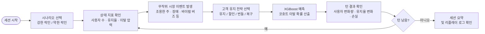
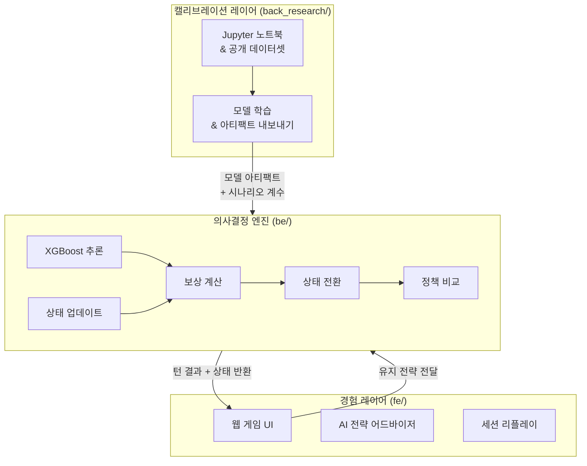

<div align="center">

# CEO Business Decision Simulator

<div>


</div>

**XGBoost 예측 모델과 React 19 UI로 구현한 경영 의사결정 시뮬레이터 — CEO 체험기**

</div>

---

## 📌 개요

**CEO Business Decision Simulator**는 사용자가 SaaS 기업의 CEO로서 경영 의사결정을 내리는 턴제 시뮬레이터입니다.

매 턴마다 실시간 비즈니스 지표를 확인하고, 무작위 시장 이벤트에 대응하며, 고객 유지 전략을 선택합니다. 학습된 XGBoost 이탈 예측 모델이 모든 의사결정에 대해 실시간 추론을 수행하고 결과를 게임 상태에 반영합니다 — 모든 선택이 데이터 기반의 측정 가능한 결과로 이어집니다.

이 프로젝트는 **SKNetworks Family AI Camp 2기 (SKN28) 4팀**의 2차 팀 프로젝트로, 풀스택 웹 개발과 응용 머신러닝을 결합하여 제작되었습니다.

---

## ✨ 주요 기능

| # | 기능명 | 설명 |
|---|--------|------|
| 1 | **턴제 CEO 경영 게임** | 세션당 최대 8턴, 매 턴 실시간 상태 지표와 함께 고객 유지 의사결정 진행 |
| 2 | **XGBoost 이탈 예측 추론** | 백엔드에서 매 턴마다 실제 고객 코호트에 `predict_proba`를 실행하여 이탈 확률 산출 |
| 3 | **무작위 시장 이벤트 엔진** | 매 턴 가중치 기반으로 시장 이벤트(조용한 주, 경쟁사 할인, 서비스 장애, 바이럴 버즈) 발생 |
| 4 | **시나리오 전환** | 두 가지 시나리오(`lockin_strong_saas`, `lockin_weak_saas`)가 엔진 코드 수정 없이 초기 상태·행동·전환 계수 변경 |
| 5 | **정책 비교** | 매 턴 선택한 전략을 휴리스틱·룩어헤드 최적·섀도 기준 정책과 자동 비교 |
| 6 | **AI 전략 어드바이저** | LLM(OpenRouter 연동)이 현재 이슈와 예상 사용자 손실을 분석하여 실행 중심의 전략 조언 제공 |
| 7 | **세션 리플레이** | 게임 전체 로그를 세션 종료 후 검토 및 분석 가능 |
| 8 | **결과 시각화** | Recharts 기반 대시보드에서 전체 턴에 걸친 사용자 변화량·유지율·이탈 확률 추이 확인 |

---

## 🛠 기술 스택

| 분류 | 기술 |
|------|------|
| **Frontend** | React 19, Vite 8, TypeScript 6, Tailwind CSS v4, shadcn/ui, Recharts, Zustand, Vercel AI SDK |
| **Backend** | FastAPI, Python 3.12, Uvicorn, pandas, imbalanced-learn |
| **ML** | XGBoost (실시간 추론), CatBoost (연구용), scikit-learn |
| **Tooling** | uv, bun 1.3, Ruff, pytest |

---

## 📁 프로젝트 구조

```text
.
├── fe/                  # 프론트엔드 — Vite + React 19 + TypeScript
│   └── src/
│       ├── app/         # 라우트 단위 페이지
│       ├── components/  # 공용 UI 컴포넌트
│       ├── features/    # 기능 모듈 (시뮬레이터, 어드바이저, 리플레이 등)
│       ├── stores/      # Zustand 전역 상태
│       ├── shared/      # 유틸리티, 타입, API 클라이언트
│       └── lib/         # shadcn/ui 헬퍼
├── be/                  # 백엔드 — FastAPI + Python 3.12
│   └── src/be/
│       ├── app.py              # FastAPI 진입점
│       ├── prediction.py       # 세션 저장소, 이벤트 샘플링, XGBoost 실시간 추론
│       ├── business_model.py   # 코호트 피처 구성 및 손실 변환
│       ├── schemas.py          # 요청/응답 및 시뮬레이터 계약 정의
│       └── settings.py         # 런타임 설정
├── back_research/       # 연구 워크스페이스 — 이탈 모델링, 노트북, 아티팩트
│   ├── myungbin/        # XGBoost 이탈 모델 (be/가 런타임에 사용하는 아티팩트 포함)
│   ├── aprkapxkf/
│   ├── wonbeenlee/
│   ├── youn/
│   └── 전하영/
├── scenarios/           # 시나리오 정의 파일 (JSON)
│   ├── lockin_strong_saas.json
│   └── lockin_weak_saas.json
└── docs/                # 아키텍처 문서 및 PRD
    ├── prds/
    └── project_specific/
```

---

## 🚀 시작하기

### 필수 조건

- Python 3.12 이상 및 [uv](https://github.com/astral-sh/uv)
- Node.js 및 [bun](https://bun.sh) 1.3 이상

### 환경 변수

| 변수명 | 위치 | 설명 |
|--------|------|------|
| `BE_LLM_API_KEY` | `be/.env` | 백엔드 LLM API 키 (모의 폴백 감지용) |
| `BE_CORS_ORIGINS` | `be/.env` | 허용할 프론트엔드 출처 (기본값: `http://localhost:5173`) |
| `VITE_LLM_API_KEY` | `fe/.env.local` | AI 전략 어드바이저용 OpenRouter API 키 |
| `VITE_BACKEND_PROXY_TARGET` | `fe/.env.local` | 백엔드 URL (기본값: `http://127.0.0.1:8000`) |

### 실행 방법

**백엔드 실행**

```bash
cd be
cp .env.example .env        # BE_LLM_API_KEY 등 환경 변수 입력
uv sync
uv run be                   # FastAPI 개발 서버 실행 (:8000)
```

**프론트엔드 실행**

```bash
cd fe
cp .env.example .env.local  # VITE_LLM_API_KEY 등 환경 변수 입력
bun install
bun dev                     # Vite 개발 서버 실행 (http://localhost:5173)
```

**연구 노트북 실행**

```bash
cd back_research
uv sync
uv run jupyter lab
```

---

## 🔄 사용 흐름



---

## 🏗 아키텍처



| 레이어 | 디렉터리 | 역할 |
|--------|----------|------|
| 경험 레이어 | `fe/` | 웹 인터페이스 — 게임 턴, 차트, AI 어드바이저, 리플레이 |
| 의사결정 엔진 | `be/` | 상태 전환, 보상 계산, 이탈 추론, 정책 비교 |
| 캘리브레이션 | `back_research/` | 오프라인 이탈 모델링; `be/`가 런타임에 로드하는 아티팩트 내보내기 |

### API 엔드포인트 (`be/`)

| 엔드포인트 | 설명 |
|------------|------|
| `GET /health` | 헬스 체크 |
| `GET /api/system/architecture` | 런타임 아키텍처 정보 조회 |
| `POST /api/prediction/session/start` | 새 게임 세션 시작 |
| `POST /api/prediction/churn` | 턴 처리 — 행동 + 이벤트 → XGBoost 이탈 추론 |

---

## 🎯 습득 기술 및 역량

| 역량 | 세부 내용 |
|------|-----------|
| **풀스택 개발** | React 19 + TypeScript 프론트엔드와 FastAPI 백엔드를 모노레포로 연결하는 풀스택 아키텍처 설계 및 구현 |
| **XGBoost 응용 ML** | 실제 고객 코호트에 `predict_proba` 기반 이탈 예측 모델 학습·보정·아티팩트 내보내기 후 런타임 로드 |
| **ML 파이프라인** | pandas·imbalanced-learn으로 데이터 전처리; Jupyter 노트북에서 XGBoost vs CatBoost 모델 비교 실험 |
| **API 설계** | Pydantic 스키마, CORS, 세션 상태 관리가 포함된 RESTful FastAPI 서비스 구축 |
| **상태 관리** | Zustand로 전역 게임 상태 관리; 엔진 레이어에서 턴 단위 상태 전환 로직 구현 |
| **데이터 시각화** | Recharts 대시보드로 전체 턴에 걸친 이탈 확률·사용자 변화량·유지율 추이 시각화 |
| **LLM 통합** | Vercel AI SDK와 OpenRouter를 연동하여 게임 UI 내 맥락 기반 전략 어드바이저 구현 |
| **시나리오 아키텍처** | JSON 기반 시나리오 시스템으로 게임 콘텐츠와 엔진 로직의 완전한 분리 달성 |

---

## 👥 팀

SKNetworks Family AI Camp 2기 — 2차 프로젝트 4팀 (SKN28 2차 프로젝트 4팀)

| 팀원 | 연구 워크스페이스 |
|------|-----------------|
| myungbin | `back_research/myungbin/` |
| aprkapxkf | `back_research/aprkapxkf/` |
| wonbeenlee | `back_research/wonbeenlee/` |
| youn | `back_research/youn/` |
| 전하영 | `back_research/전하영/` |

---

## 📄 라이선스

SKNetworks Family AI Camp 내부 교육용 프로젝트입니다.

- 내부 문서: [`docs/prds/`](./docs/prds/) · [`docs/project_specific/`](./docs/project_specific/)
- 백엔드 상세: [`be/README.md`](./be/README.md)
- 시나리오 파일: [`scenarios/lockin_strong_saas.json`](./scenarios/lockin_strong_saas.json) · [`scenarios/lockin_weak_saas.json`](./scenarios/lockin_weak_saas.json)

---

<div align="center">

**SKN28 2차 프로젝트 · 4팀**

_고객 유지를 순차적 의사결정 문제로: 상태 → 행동 → 미래 결과_

</div>
