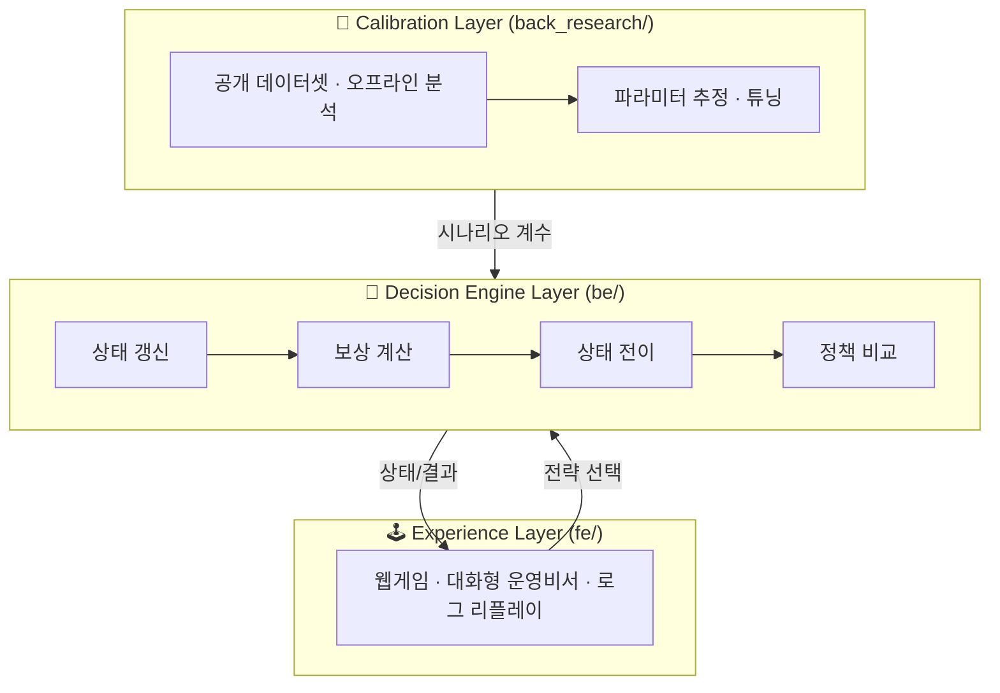

<div align="center">

# 🎮 꼬우면 니가 CEO 하던가

### Retention Strategy Simulator · 리텐션 전략 턴제 시뮬레이터

_"사용자 유지(retention)는 예측 문제가 아니라, **상태를 보고 전략을 고르는 순차적 의사결정 문제**다."_

<br/>


</div>

---

## 📖 프로젝트 소개

**「꼬우면 니가 CEO 하던가」** 는 사용자가 서비스 기업의 **의사결정권자(CEO)** 가 되어,
매 턴 retention 전략을 선택하고 **사용자 수 · 유지율 · 충성도 · 위기 상황**을 관리하는 **턴제 시뮬레이션** 프로젝트입니다.

일반적인 churn(이탈) 프로젝트는 보통 *"누가 떠날 것인가"* 를 맞추는 **예측(prediction)** 에서 멈춥니다.
하지만 실제 기업 운영은 *"지금 이 상태에서 무엇을 해야 하는가"* 라는 **의사결정(policy selection)** 에 가깝습니다.

이 프로젝트는 그 차이를 **직접 플레이해서 체감하게** 만드는 것을 목표로 합니다.

> 🧭 **핵심 질문**
> "사용자 유지 전략은 단순 예측 문제가 아니라, 상태를 보고 행동을 선택하는 **순차적 의사결정 문제(MDP)** 로 볼 수 있는가?"

### 이 프로젝트가 보여주려는 것

- 📉 prediction(예측)만으로는 부족하다는 점
- 🔀 같은 상태에서도 **전략 선택에 따라 미래가 달라진다**는 점
- 🔒 **락인(lock-in) 강도**와 기업 전략의 상호작용이 장기 가치에 영향을 준다는 점
- 🧮 이 구조를 **MDP / 정책(policy) / 가치(value)** 관점으로 해석할 수 있다는 점

---

## 🎯 무엇을 만드는가 — 3층 결과물

이 프로젝트는 하나의 제품이 아니라 **세 층의 결과물**이 하나의 이야기로 연결됩니다.

| 층 | 이름 | 설명 |
|----|------|------|
| 🧠 | **엔진(Engine)** | 상태 전이와 보상 계산이 가능한 메인 의사결정 로직 |
| 🕹️ | **시뮬레이션 경험** | 플레이어가 직접 턴별 전략을 선택하는 플레이 가능한 데모 |
| 📑 | **설명 & 보고** | 왜 이 구조가 MDP/정책 문제인지 설명하는 문서·발표 자료 |

최종 발표에서 보여주는 것은 단순한 "웹게임"이 아니라
**문제 정의 → 의사결정 구조 → 시뮬레이션 엔진 → 플레이어 체험 → 정책 비교 → 결과 해석** 의 전체 흐름입니다.

---

## 🧩 시스템 아키텍처

엔진은 아래 3개 계층 중 **핵심 계산 계층(Decision Engine Layer)** 에 해당합니다.



- **Experience Layer** — 사용자가 보고 선택하는 웹 인터페이스
- **Decision Engine Layer** — 상태(state) → 행동(action) → 결과(outcome) 를 계산하는 엔진
- **Calibration Layer** — 공개 데이터셋과 ML 분석으로 엔진 파라미터를 보정 (런타임과 분리)

> 💡 **설계 원칙:** 공개 데이터셋을 그대로 runtime truth로 쓰지 않고, **파라미터 추정과 시나리오 보정**에만 활용합니다 (semi-synthetic simulation).

---

## 🗂️ 모노레포 구조

이 저장소는 프로젝트 전체를 하나의 루트에서 관리하는 **모노레포**입니다.
역할별로 디렉터리를 분리해 작업 충돌을 줄이면서도 공통 컨텍스트를 유지합니다.

```text
.
├── 🎨 fe/             # Vite + React + Tailwind + shadcn/ui 프론트엔드
├── 🧠 be/             # uv 기반 Python 백엔드 (FastAPI · 시뮬레이션 엔진)
├── 🔬 back_research/  # uv 기반 Python 리서치/실험 환경 (churn 모델링)
├── 🗺️ scenarios/      # 락인 강/약 시나리오 데이터 (state/action/reward 정의)
├── 📚 docs/           # 기획(PRD)·기술 설계·산출물 정의 문서
└── ⚙️ .gitignore      # 로컬 개발 환경 무시 규칙
```

### 각 디렉터리 역할

| 디렉터리 | 역할 |
|----------|------|
| **`fe/`** | 사용자에게 보여지는 웹 애플리케이션. `Vite + React 19 + TypeScript`, `Tailwind v4`, `shadcn/ui` 기반. 차트(recharts), 상태관리(zustand), 대화형 UI(ai-sdk) 포함 |
| **`be/`** | 서비스 로직·API·엔진 실행 인터페이스. `FastAPI` 기반, `xgboost`·`scikit-learn`으로 예측 보정. 상태 전이/보상/정책 비교 계산 담당 |
| **`back_research/`** | 모델링·시뮬레이션 실험·데이터 분석·검증 코드. 서비스 코드(`be/`)와 분리해 실험 코드를 섞지 않도록 설계. 멤버별 연구 워크스페이스 운영 |
| **`scenarios/`** | `scenario_id · initial_state · action_catalog · event_catalog · reward_weights · transition_coefficients · policy_config` 를 담은 시나리오 정의 (락인 강/약 SaaS) |
| **`docs/`** | 프로젝트 설명서·기술 설계(`project_specific/`)·제품 요구사항(`prds/`). 코드보다 먼저 읽어야 할 아키텍처 권위 문서 |

---

## 🗺️ 시나리오 — 락인 강도 비교

같은 엔진 위에서 **시나리오만 교체**해 서로 다른 기업 환경을 실험합니다.

| 시나리오 | 설명 |
|----------|------|
| 🔒 **`lockin_strong_saas`** | 락인이 강한 SaaS — 한번 들어온 사용자가 잘 안 나가지만, 초기 진입/전환 비용이 큼 |
| 🔓 **`lockin_weak_saas`** | 락인이 약한 SaaS — 진입은 쉽지만 이탈도 쉬워 지속적인 retention 전략이 필요 |

> 핵심 메시지: **같은 초기 상태라도 기업 특성(락인 강/약)에 따라 최적 전략이 달라진다.**

---

## 🎲 한 턴의 흐름 (Gameplay Loop)

```text
session entry → turn play → turn result → policy comparison → session summary → replay
```

매 턴 플레이어는 **현재 상태(지표)** 를 읽고 **전략(action)** 을 선택하며,
그 선택이 다음 턴 이후 상태에 어떤 흔적을 남기는지, 그리고 **기준 정책(heuristic / optimal / shadow)** 과 비교해
자신의 판단이 얼마나 좋았는지를 확인합니다.

---

## 🛠️ 기술 스택

<table>
<tr><th>영역</th><th>스택</th></tr>
<tr>
<td>🎨 Frontend</td>
<td>


</td>
</tr>
<tr>
<td>🧠 Backend</td>
<td>


</td>
</tr>
<tr>
<td>🔬 Research</td>
<td>


</td>
</tr>
<tr>
<td>⚙️ Tooling</td>
<td>


</td>
</tr>
</table>

### 개발 환경 원칙

- 🐍 **Python**: 버전 `3.12` 고정, 의존성·실행은 모두 **`uv`** 기준 (`pip`/`requirements.txt`/Poetry 금지)
- 🎨 **Frontend**: 패키지 관리는 **`bun`**, 소스 수정은 항상 소스 파일에서 (빌드 산출물 직접 수정 금지)
- 🧪 실험 코드(`back_research/`)와 서비스 코드(`be/`)는 분리
- 🗃️ IDE 전용 설정(`.vscode/`, `.idea/`, `.zed/` 등)은 커밋하지 않음

---

## 🚀 시작하기

### 🧠 Backend (`be/`)

```bash
cd be
uv sync
uv run be          # 엔진/API 실행
```

### 🔬 Research (`back_research/`)

```bash
cd back_research
uv sync
uv run jupyter lab # 모델링/실험 노트북
```

### 🎨 Frontend (`fe/`)

```bash
cd fe
bun install
bun dev            # 개발 서버
bun run build      # 프로덕션 빌드
```

---

## ✅ 검증 방법

| 영역 | 명령어 |
|------|--------|
| 🧠 Backend | `cd be && uv run pytest` · `uv run ty check` |
| 🔬 Research | `cd back_research && uv run pytest` · `uv run ty check` |
| 🎨 Frontend | `cd fe && bun run build` |

---

## 🧭 시작 순서 제안

1. 📚 `docs/` 문서를 먼저 읽고 프로젝트 범위와 엔진 구조를 이해한다.
2. 🧠 `be/`에서 API 또는 엔진 실행 단위를 정의한다.
3. 🔬 `back_research/`에서 시뮬레이션/분석 코드를 분리해 실험한다.
4. 🎨 `fe/`에서 사용자 흐름과 시각 인터페이스를 구현한다.
5. 🔗 각 레이어를 루트 저장소 기준으로 함께 버전 관리한다.

---

## 🌿 협업 규칙 (요약)

- 이 저장소는 **GitHub Flow** 를 사용합니다. `master` 직접 작업 대신 기능 브랜치에서 작업합니다.
- 커밋 메시지와 PRD 문서는 **한국어**로 작성합니다.
- 자세한 규칙은 [`CLAUDE.md`](./CLAUDE.md) · [`AGENTS.md`](./AGENTS.md) · [`docs/`](./docs) 참고.

---

## 📌 현재 상태

- ✅ 모노레포 루트 구조 생성 완료
- ✅ Python 워크스페이스 `be`, `back_research` 초기화 완료 (`uv` · `pytest` · `ty` · `ruff`)
- ✅ 프론트엔드 `Vite + Tailwind + shadcn/ui` 초기화 완료
- ✅ 시뮬레이션 엔진 / 예측(prediction) 리팩터링 반영 (PR #19)
- ✅ 락인 강/약 시나리오 정의 완료
- ✅ 문서(PRD·기술 설계) 폴더 분리 완료

---

<div align="center">

**SKN28 2기 · 2nd Project · 4Team**

_Retention 문제를 `state → action → future outcome` 구조로 재해석하는 기술 + 기획 결합형 프로젝트_

</div>
