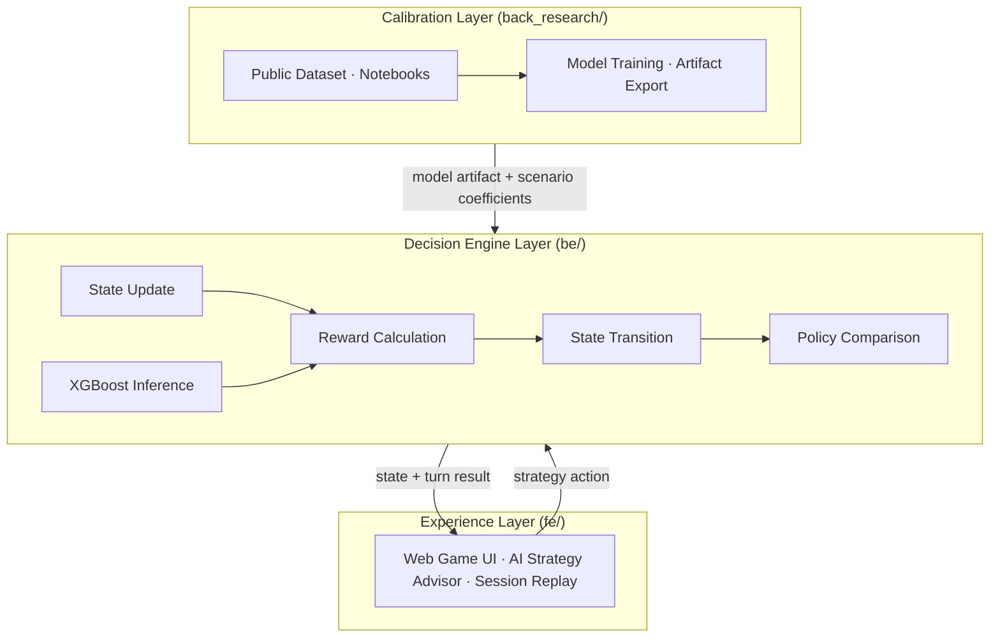

<div align="center">

# CEO Experience Simulator (CEO 체험기)

> A turn-based retention strategy simulator where you play as the CEO of a SaaS company, making policy decisions each turn to manage users, retention, and crises.
> 사용자가 SaaS 기업의 CEO가 되어 매 턴 리텐션 전략을 선택하고 사용자 수·유지율·위기 상황을 관리하는 턴제 시뮬레이터.


</div>

---

## Tech Stack (기술 스택)

<table>
<tr><th>Area (영역)</th><th>Stack</th></tr>
<tr>
<td>Frontend</td>
<td>


</td>
</tr>
<tr>
<td>Backend</td>
<td>


</td>
</tr>
<tr>
<td>Research</td>
<td>


</td>
</tr>
<tr>
<td>Tooling</td>
<td>


</td>
</tr>
</table>

---

## Features (주요 기능)

- **Turn-based strategy gameplay (턴제 전략 플레이)** — Each turn, read the current state metrics (user base, retention score, churn pressure, trust score, etc.) and choose one of four retention actions: Hold Position, Discount Offer, Bundle Push, or Service Recovery.
- **Live churn inference (실시간 이탈 예측)** — The backend runs in-process XGBoost inference against a real customer cohort on every turn. Churn probability is derived from `predict_proba` via a calibrated expected-loss rate, not a hard threshold.
- **Random event engine (무작위 이벤트 엔진)** — Each turn draws a random event (Quiet Week, Competitor Discount, Service Outage, Viral Buzz) with weighted sampling from the active scenario. Event effects modify state before the player's action resolves.
- **Scenario swap (시나리오 교체)** — Two pre-built scenarios (`lockin_strong_saas`, `lockin_weak_saas`) run on the same engine. Swapping the scenario changes initial state, action catalog, event catalog, reward weights, and transition coefficients without touching the engine code.
- **Policy comparison (정책 비교)** — After each turn, the simulator compares the player's choice against reference policies (heuristic, lookahead-optimal, shadow) so the player can see how their decision ranked.
- **AI strategy advisor (AI 전략 조언자)** — An LLM assistant (OpenRouter-backed, configurable model) is embedded in the frontend. It reads the current incident, active policies, and projected user loss, then gives concise, action-oriented guidance.
- **Session replay (세션 리플레이)** — Full game log is available for post-session review.

---

## Project Structure (프로젝트 구조)

```text
.
├── fe/                  # Frontend — Vite + React 19 + TypeScript
│   └── src/
│       ├── app/         # Route-level pages
│       ├── components/  # Shared UI components
│       ├── features/    # Feature modules (simulator, advisor, replay, …)
│       ├── stores/      # Zustand global state
│       ├── shared/      # Utilities, types, API clients
│       └── lib/         # shadcn/ui helpers
├── be/                  # Backend — FastAPI + Python 3.12
│   └── src/be/
│       ├── app.py              # FastAPI entrypoint
│       ├── prediction.py       # Session store, event sampling, live inference
│       ├── business_model.py   # Cohort feature composition and loss translation
│       ├── schemas.py          # Request/response and simulator contracts
│       └── settings.py         # Repo-root path and runtime settings
├── back_research/       # Research workspace — churn modeling, notebooks, artifacts
│   ├── myungbin/        # XGBoost churn model (exported artifact used by be/)
│   ├── aprkapxkf/
│   ├── wonbeenlee/
│   ├── youn/
│   └── 전하영/
├── scenarios/           # Scenario definitions (JSON)
│   ├── lockin_strong_saas.json
│   └── lockin_weak_saas.json
└── docs/                # Architecture docs, PRDs
    ├── prds/            # Product requirement documents (Korean)
    └── project_specific/# Technical design and agent workspace guidelines
```

---

## Usage Flow (사용 흐름)

```text
Session start
  → Select scenario (Lock-In Strong / Lock-In Weak)
  → Turn loop (up to 8 turns per scenario):
      1. View current state metrics
      2. Read random event drawn for this turn
      3. Choose a retention action
      4. Engine resolves: event effects + action effects + transition coefficients
      5. XGBoost computes churn probability on sampled cohort row
      6. View turn result: user delta, retention change, projected loss
      7. Compare against reference policies
  → Session summary
  → Replay log
```

---

## Architecture (아키텍처)



**Three layers:**

| Layer | Directory | Role |
|-------|-----------|------|
| Experience | `fe/` | Web interface — game turns, charts, AI advisor, replay |
| Decision Engine | `be/` | State transition, reward, churn inference, policy comparison |
| Calibration | `back_research/` | Offline churn modeling; exports artifact loaded by `be/` at runtime |

**API surface (`be/`):**

| Endpoint | Description |
|----------|-------------|
| `GET /health` | Health check |
| `GET /api/system/architecture` | Runtime architecture info |
| `POST /api/prediction/session/start` | Start a new game session |
| `POST /api/prediction/churn` | Resolve a turn (action + event → churn inference) |

---

## Environment Setup (환경 설정)

### Backend (`be/.env`)

Copy `be/.env.example` to `be/.env` and fill in:

```env
BE_CORS_ORIGINS=http://localhost:5173
BE_LLM_API_KEY=              # LLM API key (used for mock fallback detection)
BE_LLM_BASE_URL=https://api.openai.com/v1
BE_LLM_MODEL=gpt-4o-mini
BE_LLM_ALLOW_MOCK_FALLBACK=true
```

### Frontend (`fe/.env`)

Copy `fe/.env.example` to `fe/.env.local` and fill in:

```env
VITE_API_BASE_URL=
VITE_BACKEND_PROXY_TARGET=http://127.0.0.1:8000
VITE_LLM_API_KEY=            # OpenRouter (or compatible) API key
VITE_LLM_BASE_URL=https://openrouter.ai/api/v1
VITE_LLM_MODEL=openai/gpt-oss-120b
VITE_STRATEGY_MODEL_OPTIONS=openai/gpt-oss-120b,openai/gpt-4o-mini
VITE_LLM_APP_NAME=SKN28 Simulator
VITE_LLM_SYSTEM_PROMPT=You are the strategy operator for a retention simulator. Keep answers concise, action-oriented, and tied to the current incident, active policies, and projected user loss.
```

---

## How to Run (실행 방법)

### Backend (백엔드)

```bash
cd be
uv sync
uv run be                    # development server with reload
# or: uv run uvicorn be.app:app --host 127.0.0.1 --port 8000
```

### Frontend (프론트엔드)

```bash
cd fe
bun install
bun dev                      # development server at http://localhost:5173
bun run build                # production build
```

### Research notebooks (리서치 노트북)

```bash
cd back_research
uv sync
uv run jupyter lab
```

### Verification (검증)

| Area | Command |
|------|---------|
| Backend | `cd be && uv run pytest` · `uv run ty check` · `uv run ruff check` |
| Research | `cd back_research && uv run pytest` · `uv run ty check` |
| Frontend | `cd fe && bun run build` |

---

## Team (팀)

SKN28 2nd Project, Team 4 (SKN28 2차 프로젝트 4팀)

| Member | Research workspace |
|--------|--------------------|
| myungbin | `back_research/myungbin/` |
| aprkapxkf | `back_research/aprkapxkf/` |
| wonbeenlee | `back_research/wonbeenlee/` |
| youn | `back_research/youn/` |
| 전하영 | `back_research/전하영/` |

---

## License & References (라이선스 & 참고 문서)

- Internal project documentation: [`docs/prds/`](./docs/prds/) · [`docs/project_specific/`](./docs/project_specific/)
- Backend detail: [`be/README.md`](./be/README.md)
- Toolchain rules: [`CLAUDE.md`](./CLAUDE.md) · [`AGENTS.md`](./AGENTS.md)
- Scenarios: [`scenarios/lockin_strong_saas.json`](./scenarios/lockin_strong_saas.json) · [`scenarios/lockin_weak_saas.json`](./scenarios/lockin_weak_saas.json)

---

<div align="center">

**SKN28 2기 · 2nd Project · 4Team**

_Retention as a sequential decision problem: state → action → future outcome_
_(리텐션을 순차적 의사결정 문제로: 상태 → 행동 → 미래 결과)_

</div>
