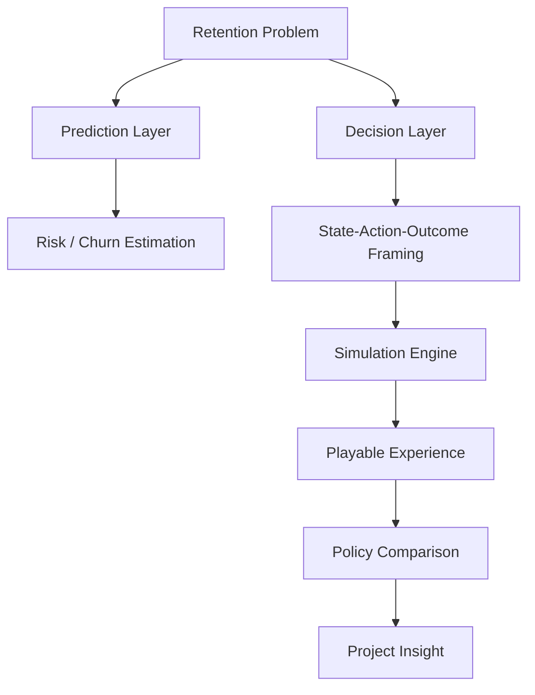
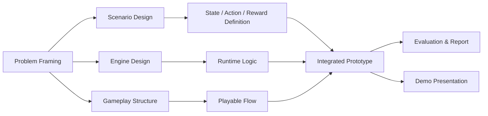

# 프로젝트 문서: 꼬우면 니가 CEO 하던가 — Project Description & Project Plan

## 0. 문서 목적

본 문서는 프로젝트 전체를 **기술 구현 이전의 상위 개념**에서 정의한다.  
목적은 다음과 같다.

- 이 프로젝트가 무엇을 만들려는지 명확히 설명
- 왜 이 프로젝트가 retention/churn 문제를 게임으로 다루는지 정리
- 범위와 비범위를 구분
- 작업 스트림과 단계별 산출물을 정리
- 기술 문서, 데모, 발표가 하나의 이야기로 연결되게 함

이 문서는 **전체 프로젝트 관점**을 다룬다.  
구현 상세는 별도 기술 문서에서 다룬다.

---

## 1. 프로젝트 설명(Project Description)

### 1.1 프로젝트 이름
**꼬우면 니가 CEO 하던가**  
부제: **Retention Strategy Simulator**

### 1.2 한 줄 설명
사용자는 서비스 기업의 의사결정권자가 되어, 매 턴 retention 전략을 선택하고 사용자 수/유지율/충성도/위기 상황을 관리하며, 자신의 판단과 기준 정책의 차이를 체험하는 **턴제 시뮬레이션 프로젝트**다.

### 1.3 프로젝트의 핵심 질문
이 프로젝트가 다루는 본질적 질문은 다음과 같다.

> “사용자 유지 전략은 단순 예측 문제가 아니라, 상태를 보고 행동을 선택하는 순차적 의사결정 문제로 볼 수 있는가?”

그리고 이 질문을 아래 방식으로 보여주고자 한다.

- prediction만으로는 부족하다는 점
- 같은 상태에서도 전략 선택에 따라 미래가 달라진다는 점
- 락인 강도와 기업 전략의 상호작용이 장기 가치에 영향을 준다는 점
- 이러한 구조를 MDP/정책/가치 관점으로 해석할 수 있다는 점

---

## 2. 프로젝트 배경

### 2.1 문제 인식
일반적인 churn 프로젝트는 대체로 다음 수준에서 멈춘다.

- 어떤 사용자가 떠날 가능성이 높은가
- 어떤 feature가 churn과 상관관계가 높은가
- 특정 시점의 이탈 여부를 얼마나 잘 맞출 수 있는가

하지만 실제 기업 운영은 그보다 복잡하다.

- 지금 어떤 상황인가
- 어떤 대응 전략을 선택할 수 있는가
- 지금의 선택이 다음 턴 이후 상태에 어떤 흔적을 남기는가
- 단기적으로는 손해지만 장기적으로는 더 나은 전략은 무엇인가

즉, 실제 의사결정은 **prediction** 보다 **policy selection** 에 가깝다.

### 2.2 왜 게임 형식인가
이 프로젝트는 이론 설명만으로 끝나지 않고,  
사용자가 직접 턴을 진행하며 다음을 체감하게 만들고자 한다.

- 상태를 읽는 감각
- 전략 선택의 책임
- 지표 변화의 결과
- 장기/단기 trade-off
- “내 전략”과 “더 나은 정책”의 차이

게임 형식은 이 구조를 가장 직관적으로 전달할 수 있는 프레임이다.

---

## 3. 프로젝트 목표

### 3.1 핵심 목표
1. retention/churn 문제를 순차 의사결정 문제로 재해석한다.
2. 이를 MDP/정책/가치 기반 시뮬레이션으로 구조화한다.
3. 사용자가 직접 전략을 선택하고 결과를 체감하게 한다.
4. 같은 초기 상태에서도 기업 특성(락인 강/약)에 따라 최적 전략이 달라짐을 보여준다.
5. 프로젝트 결과를 기술 문서, 데모, 설명 자료의 세 층으로 정리한다.

### 3.2 사용자 경험 목표
- “왜 이 선택이 좋았는지/나빴는지”를 감으로 이해하게 한다.
- 숫자와 전략의 관계를 직관적으로 느끼게 한다.
- RL/MDP를 몰라도 state → action → outcome 구조를 이해하게 한다.

### 3.3 연구/설명 목표
- prediction과 policy의 차이를 드러낸다.
- 락인 효과를 상태 전이 구조로 해석한다.
- semi-synthetic simulation이 왜 필요한지 설득력 있게 보여준다.

---

## 4. 프로젝트 범위

### 4.1 포함 범위
- retention 전략을 다루는 턴제 시뮬레이션
- MDP 유사 구조의 엔진 설계
- 시나리오 기반 상태/행동/보상 정의
- 플레이어 선택과 기준 정책 비교
- 최종 데모/리포트/문서 패키지 제작

### 4.2 제외 범위
- 실제 기업 환경에서의 온라인 정책 배포
- 실시간 자동 학습형 RL 서비스 운영
- 주가 예측 또는 금융 의사결정 도구
- 완전 오픈월드 RPG 수준의 자유형 시뮬레이션
- 실제 운영 데이터에 대한 production-grade causal inference 시스템

---

## 5. 핵심 개념적 구조

### 5.1 구조 설명
이 프로젝트는 “예측”을 부정하지 않는다.  
다만 예측을 최종 목적이 아니라 **의사결정 엔진을 보정하는 하위 요소**로 둔다.

즉:
- prediction은 일부
- simulation은 중심
- policy comparison은 전달 장치
- gameplay는 체험 장치

---

## 6. 프로젝트의 결과물 서사

이 프로젝트는 하나의 제품이 아니라 **세 층의 결과물**로 구성된다.

1. **엔진**
   - 상태 전이와 보상 계산이 가능한 메인 로직
2. **시뮬레이션 경험**
   - 플레이어가 직접 턴별 전략을 선택하는 데모
3. **설명 및 보고**
   - 왜 이 구조가 MDP/정책 문제인지 설명하는 자료

즉 최종 발표에서 보여주는 것은 단지 “웹게임”이 아니라,

- 문제 정의
- 의사결정 구조
- 시뮬레이션 엔진
- 플레이어 체험
- 정책 비교
- 결과 해석

이 연결 전체다.

---

## 7. 주요 사용자 및 이해관계자

### 7.1 직접 사용자
- 발표/데모를 체험하는 사용자
- retention/churn 문제를 직관적으로 이해하고 싶은 사람
- PM, 기획자, 데이터 관련 배경을 가진 사용자

### 7.2 간접 이해관계자
- 프로젝트 리뷰어
- 기술 문서를 읽는 엔지니어/연구자
- 시뮬레이터 결과를 통해 개념을 이해하려는 청중

### 7.3 이들에게 주고 싶은 가치
- 단순 지표 예측을 넘어선 의사결정 관점
- 상태 기반 사고 방식
- 전략 간 trade-off 이해
- 락인 구조가 왜 중요한지에 대한 직관

---

## 8. 작업 스트림(Workstreams)

### 8.1 Workstream 1 — Problem Framing
다루는 내용:
- 왜 churn prediction만으로는 부족한가
- 왜 sequential decision framing이 필요한가
- 왜 락인 비교 시나리오가 의미 있는가

### 8.2 Workstream 2 — Scenario Design
다루는 내용:
- 락인 강/약 기업 시나리오 정의
- 상태 변수 정의
- 액션 카탈로그 정의
- 이벤트와 상황 요소 정의

### 8.3 Workstream 3 — Engine Design
다루는 내용:
- 전이 로직
- 보상 계산
- 기준 정책 비교
- 로그 및 리플레이 구조

### 8.4 Workstream 4 — Gameplay Structure
다루는 내용:
- 한 턴의 흐름
- 플레이어가 무엇을 보고 선택하는가
- 결과를 어떤 정보 구조로 보여줄 것인가

정리 원칙:
- 프론트 요구사항은 시각 테마가 아니라 정보 구조 기준으로 정의한다.
- 핵심 흐름은 `session entry -> turn play -> turn result -> policy comparison -> session summary -> replay` 로 잡는다.
- component 단위 책임과 semantic HTML 구조는 별도 프론트 요구사항 문서에서 정의한다.

### 8.5 Workstream 5 — Evaluation & Report
다루는 내용:
- 플레이어 전략과 기준 정책 비교
- 시나리오 차이 해석
- 프로젝트 보고서/발표 구조 정리

---

## 9. 단계별 진행 계획

### Phase 0 — Concept Lock
목표:
- 프로젝트 정의 확정
- 핵심 질문 고정
- 범위와 비범위 확정

산출물:
- 프로젝트 설명 문서
- 핵심 용어 정의
- 시나리오 방향성 초안

### Phase 1 — Scenario & Engine Spec
목표:
- 상태/행동/이벤트/보상 구조 확정
- 엔진 기술 문서 작성
- 최소 실행 가능 로직 설계

산출물:
- technical design doc
- state/action catalog
- turn loop 정의

### Phase 2 — Prototype Build
목표:
- 플레이 가능한 엔진 프로토타입 제작
- 기준 정책과 비교 가능한 구조 구현

산출물:
- runnable simulation core
- replay/logging
- comparison packet

### Phase 3 — Experience Integration
목표:
- 플레이 흐름 정리
- 설명 레이어 연결
- 발표용 스토리라인 구축

산출물:
- playable demo
- frontend requirements structure
- explanation flow
- final presentation structure

### Phase 4 — Evaluation & Packaging
목표:
- 전체 패키지를 발표/전달 가능한 형태로 정리
- 최종 문서/리포트/스크립트 정리

산출물:
- final deliverables spec
- evaluation notes
- demo script

---

## 10. 프로젝트 운영 원칙

### 10.1 원칙 1 — Prediction-first가 아니라 Decision-first
이 프로젝트는 “누가 떠나는가”보다  
“이 상태에서 무엇을 해야 하는가”에 더 무게를 둔다.

### 10.2 원칙 2 — 수학보다 전달 가능성 우선
내부는 기술적으로 탄탄해야 하지만,  
최종 전달은 체험 가능한 구조여야 한다.

### 10.3 원칙 3 — 데이터는 보정에 사용
공개 데이터셋을 그대로 runtime truth로 사용하지 않는다.  
데이터는 파라미터 추정과 시나리오 보정에 활용한다.

### 10.4 원칙 4 — 게임성과 설명 가능성의 균형
너무 게임적이면 연구성이 약해지고,  
너무 분석적이면 체험성이 약해진다.  
두 층을 동시에 가져가야 한다.

---

## 11. 성공 조건

### 11.1 제품 측면
- 사용자가 한 턴의 의사결정 구조를 이해할 수 있다.
- 전략 선택이 실제로 다음 결과를 바꾸는 것으로 느껴진다.
- 같은 문제를 prediction과 policy 두 관점에서 다르게 볼 수 있음을 이해시킨다.

### 11.2 기술 측면
- 상태/행동/보상/전이 구조가 문서화되어 있다.
- 기준 정책 비교가 가능하다.
- replay/logging이 가능하다.
- 시나리오 교체가 가능하다.

### 11.3 프로젝트 측면
- 발표/시연 가능한 형태의 프로토타입이 존재한다.
- 기술 문서와 프로젝트 설명이 일관된다.
- 최종 산출물이 단일 이야기로 묶여 있다.

---

## 12. 핵심 리스크와 대응

### 리스크 1. 범위 과대
문제:
- 게임, 시뮬레이터, 설명 시스템을 한 번에 크게 만들 위험

대응:
- rules-only MVP → hybrid → advanced 로 단계화

### 리스크 2. 지나친 기술화
문제:
- 엔진은 정교하지만 프로젝트 메시지가 전달되지 않을 위험

대응:
- 각 기술 요소가 프로젝트 질문과 직접 연결되도록 문서화

### 리스크 3. 지나친 단순화
문제:
- 너무 단순하면 churn prediction demo와 차별성이 약해짐

대응:
- state persistence, action trade-off, policy comparison은 반드시 유지

### 리스크 4. 데이터 부족
문제:
- 실제 sequential policy data 부족

대응:
- semi-synthetic simulator로 정의하고 calibration pipeline 문서화

---

## 13. 프로젝트 최종 메시지

이 프로젝트의 핵심 메시지는 다음과 같다.

> **Retention 문제는 단순한 분류 문제가 아니라, 상태를 읽고 전략을 고르는 순차적 의사결정 문제다.**

그리고 이 프로젝트는 그 메시지를 아래 3단 구조로 전달한다.

1. 문서로 설명한다.
2. 엔진으로 구현한다.
3. 플레이를 통해 체험하게 한다.

---

## 14. 최종 프로젝트 정의

> `꼬우면 니가 CEO 하던가` 는 retention/churn 문제를  
> **state → action → future outcome** 구조로 재해석하고,  
> 이를 플레이 가능한 시뮬레이션 경험으로 번역하는  
> **기술+기획 결합형 프로젝트**다.

이 프로젝트는 예측 모델을 넘어서,  
사용자가 직접 전략을 선택하고 그 결과를 겪으며  
정책, 가치, 장기 효과의 개념을 체감하게 만드는 것을 목표로 한다.
