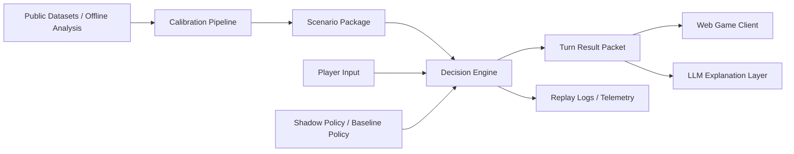
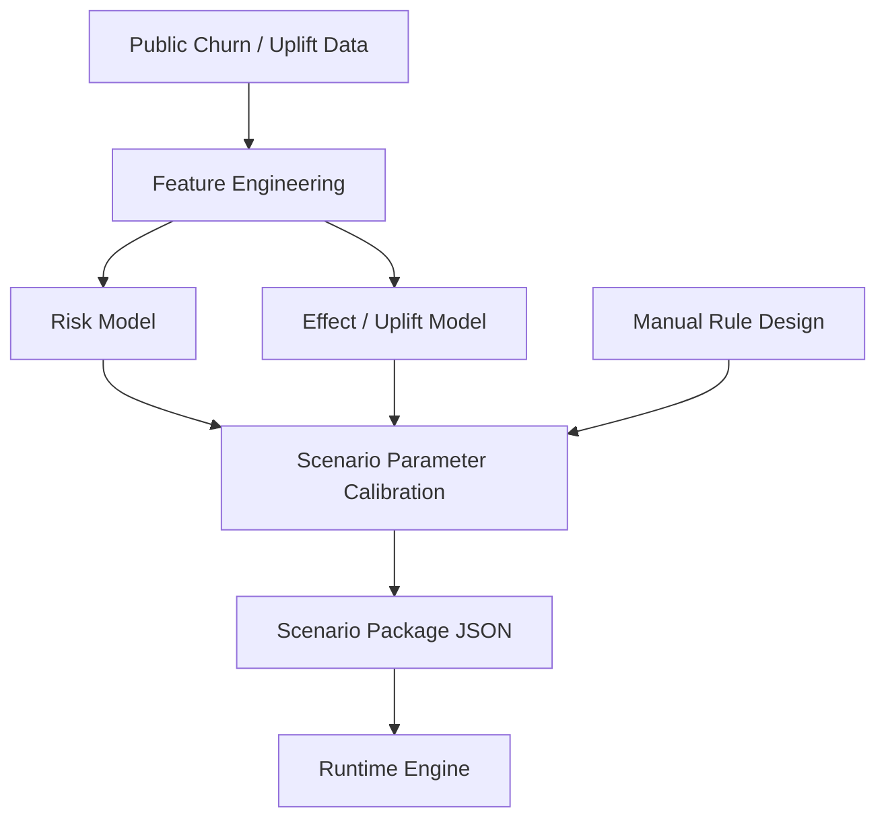
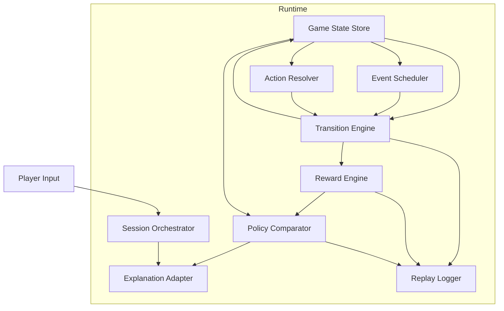
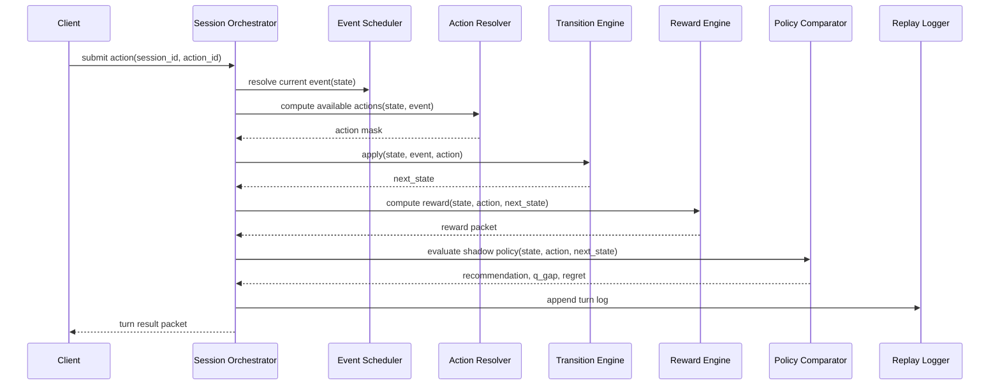

# 기술 문서: Retention Strategy Simulator Engine Technical Design

## 0. 문서 목적

본 문서는 `꼬우면 니가 CEO 하던가` 프로젝트의 **메인 엔진**을 기술적으로 정의한다.  
범위는 다음을 포함한다.

- 엔진의 역할과 책임
- 내부 모듈 구조
- 상태/행동/이벤트/보상/전이 로직
- 정책 계산 및 비교 방식
- 런타임 처리 순서
- 데이터 계약(JSON-like schema)
- 오프라인 보정(calibration)과 런타임 분리
- API 및 로깅 구조
- 검증 포인트 및 리스크

본 문서는 **UI 시각 디자인**이 아니라, **게임이 실제로 돌아가기 위한 계산·상태·흐름의 정의서**다.

---

## 1. 프로젝트 기술 설명(Project Description)

### 1.1 한 줄 정의
Retention Strategy Simulator Engine은 **서비스 운영 의사결정을 턴제 MDP 유사 구조로 해석하고, 사용자 행동/서비스 상황/기업 전략의 상호작용을 시뮬레이션하는 상태 기반 엔진**이다.

### 1.2 기술적 목표
이 엔진의 목표는 단순 churn prediction이 아니라 다음을 동시에 만족하는 것이다.

1. **Sequential Decision Making**
   - 플레이어의 전략 선택이 한 턴만이 아니라 다음 턴 이후 상태에도 영향을 미치게 한다.

2. **Human Playable**
   - 사용자가 턴 단위로 전략을 선택하고 결과를 볼 수 있어야 한다.

3. **Policy Comparable**
   - 사람의 선택과 기준 정책(heuristic / optimal / shadow policy)을 비교할 수 있어야 한다.

4. **Scenario Configurable**
   - 동일 엔진 위에서 “락인이 약한 기업”과 “락인이 강한 기업” 같은 시나리오를 바꿔 실행할 수 있어야 한다.

5. **Explainable**
   - 각 턴의 상태 변화와 점수 변화가 구조적으로 설명 가능해야 한다.

### 1.3 시스템의 위치
본 엔진은 아래 세 층 중 **핵심 계산 계층**에 해당한다.

- **Experience Layer**: 웹게임, 대화형 비서, 로그 리플레이
- **Decision Engine Layer**: 상태 갱신, 보상 계산, 전이 처리, 정책 비교
- **Calibration Layer**: 공개 데이터셋과 오프라인 분석을 통해 파라미터를 추정/튜닝

---

## 2. 기술적 접근 방식

### 2.1 기본 철학
본 프로젝트는 처음부터 “실서비스용 온라인 RL”을 만드는 것이 아니라, 아래 순서로 진행하는 것이 바람직하다.

1. **MVP 단계**: 규칙 기반 + 시나리오 계수 기반 엔진
2. **Hybrid 단계**: 외부 데이터로 추정한 risk/effect 모델을 엔진 파라미터에 반영
3. **Advanced 단계**: planner / value iteration / approximate policy evaluation 추가

즉, 핵심 런타임은 **deterministic + stochastic simulation engine**이고,  
정책 최적화는 이 엔진 위에 붙는 **shadow policy layer**로 둔다.

### 2.2 왜 이 구조가 적합한가
공개 churn/uplift 데이터는 대체로 아래 한계가 있다.

- 완전한 순차 의사결정 로그가 부족함
- action coverage가 부족함
- 실제 기업 전략 로그가 노출되지 않음

따라서 런타임은 **semi-synthetic simulation** 으로 가고,  
데이터는 **상태 변수/위험도/효과 계수 보정**에 활용하는 것이 현실적이다.

---

## 3. 시스템 컨텍스트



### 3.1 컨텍스트 설명
- `Calibration Pipeline`은 오프라인에서만 실행된다.
- `Decision Engine`은 런타임 핵심이다.
- `LLM Explanation Layer`는 **엔진 결과를 해설**하지, 상태를 계산하지 않는다.
- `Shadow Policy`는 플레이어 선택과 비교하기 위한 기준 정책이다.

---

## 4. 핵심 엔티티 정의

### 4.1 State
게임 상태는 크게 두 층으로 분리한다.

#### A. Visible State (플레이어에게 노출되는 상태)
- 현재 사용자 수
- 유지율/이탈 방향
- 과금 전환율
- 충성도/락인 수준
- 현재 이슈 강도
- 서비스 분위기/신뢰도

#### B. Latent State (엔진 내부에만 존재하는 상태)
- 세그먼트별 churn pressure
- action fatigue
- incident backlog
- trust decay accumulator
- lock-in inertia
- competitive pressure
- budget stress
- recent action memory

### 4.2 Action
행동은 “플레이어가 한 턴에 선택하는 경영 전략”이다.

예시 action family:
- `discount_offer`
- `bundle_push`
- `service_recovery`
- `long_term_contract`
- `feature_campaign`
- `vip_care`
- `hold_position`

### 4.3 Event
이벤트는 플레이어가 직접 고르지 않지만 상태에 영향을 주는 외생 변수다.

예시:
- 서비스 장애
- 경쟁사 할인
- 바이럴 유입
- 커뮤니티 불만 확산
- 핵심 세그먼트 이탈 조짐
- 내부 운영 압박 증가

### 4.4 Reward
보상은 단순 사용자 수 증가가 아니라 **운영 가치**로 계산한다.

예시 구조:
- 단기 수익 기여
- 사용자 기반 질적 개선
- 락인/충성도 개선
- 비용/페널티 차감

### 4.5 Policy
정책은 상태를 입력받아 행동을 고르는 규칙이다.

정책 종류:
- Human policy
- Baseline heuristic policy
- Shadow optimal policy
- Restricted safe policy (지원 영역 밖 행동 제한)

---

## 5. 상태 표현(State Representation)

### 5.1 최소 상태 벡터 제안

```text
s_t = [
  turn_index,
  user_base,
  active_ratio,
  retention_score,
  churn_pressure,
  paying_ratio,
  lock_in_score,
  trust_score,
  incident_pressure,
  competitive_pressure,
  budget_stress,
  action_fatigue,
  last_action,
  segment_mix
]
```

### 5.2 상태 변수 설계 원칙
1. **게임 플레이에 필요한 해석 가능성**
   - 너무 많은 feature를 그대로 노출하지 않는다.
2. **Markov-like 압축**
   - 직전 N턴의 정보를 summary variable로 압축한다.
3. **시나리오 교체 가능성**
   - 변수 정의는 유지하되 계수만 바꾸어 다른 기업 시나리오에 적용 가능해야 한다.
4. **설명 가능성**
   - 각 변수는 LLM 또는 리포트에서 인간이 읽을 수 있는 의미를 가져야 한다.

### 5.3 상태 범주화 전략
초기 엔진에서는 연속값을 그대로 쓰기보다 아래 형태가 실용적이다.

- 내부 계산: 실수/정수 continuous value
- 정책/리포트 요약: binning된 qualitative label

예:
- `lock_in_score = 0.74` → “높음”
- `incident_pressure = 0.21` → “낮음”

---

## 6. 행동 공간(Action Space)

### 6.1 행동 정의 원칙
- 플레이어는 한 턴에 하나의 primary action만 선택
- 행동은 단기 효과와 장기 효과를 동시에 가짐
- 일부 행동은 특정 상황에서만 사용 가능
- 일부 행동은 누적 사용 시 fatigue를 발생시킴

### 6.2 action spec 예시

```json
{
  "action_id": "bundle_push",
  "family": "retention_growth",
  "label": "번들 강화",
  "cost_profile": {
    "direct_cost": 0.12,
    "ops_cost": 0.05
  },
  "cooldown": 1,
  "eligibility_rules": [
    "paying_ratio >= 0.10",
    "incident_pressure < 0.8"
  ],
  "effect_targets": [
    "lock_in_score",
    "paying_ratio",
    "trust_score"
  ]
}
```

### 6.3 action masking
엔진은 매 턴 `available_actions` 를 계산해야 한다.

현재 구현 메모:

- 이 문단은 개념 설계 기준이다.
- 현재 FE 런타임 구현은 `available_actions` 버튼 목록을 직접 쓰지 않는다.
- 대신 `incident 충격 -> editable raw model input form -> budget 제약` 구조로 플레이어 선택지를 제공한다.
- 즉 현재 플레이어가 실제로 고르는 것은 action 목록보다 `strict raw model input` 조정안에 가깝다.

마스킹 이유:
- 현재 상태에서 실행 불가한 액션 방지
- 운영 규칙 위반 방지
- 이벤트 충돌 방지
- demo 플레이의 품질 유지

---

## 7. 이벤트 시스템(Event System)

### 7.1 이벤트의 역할
이벤트는 매 턴 게임의 불확실성과 맥락을 제공한다.  
이벤트가 없으면 엔진은 정적인 전략 퍼즐이 되고, 이벤트가 있으면 **운영 환경**이 된다.

### 7.2 이벤트 분류
- `incident_event`: 장애, CS 폭증
- `market_event`: 경쟁사 할인, 외부 노이즈
- `community_event`: 유저 불만, 입소문
- `growth_event`: 바이럴, 제휴, 호재
- `internal_event`: 예산 압박, 인력 부족

### 7.3 이벤트 처리 순서
이벤트는 일반적으로 action 이전에 “상황 제시”로 노출되지만, 엔진 로직상은 아래 두 방식 중 하나를 선택할 수 있다.

#### 방식 A. event-first
- 이벤트 발생
- 상태 악화/개선
- 플레이어 대응

#### 방식 B. reveal-first / apply-after-action
- 이벤트 노출
- 플레이어 대응 선택
- 이벤트 + 액션을 함께 반영

권장 방식은 **B**다.  
이유: 플레이어가 “이번 턴 무엇에 대응하는가”를 더 명확히 느낄 수 있다.

---

## 8. 전이 함수(Transition Logic)

### 8.1 전이 함수 개념
전이는 다음 상태를 결정하는 핵심 함수다.

\[
s_{t+1} = f(s_t, a_t, e_t, \theta_{scenario}, \epsilon_t)
\]

여기서:
- \(s_t\): 현재 상태
- \(a_t\): 플레이어 행동
- \(e_t\): 외생 이벤트
- \(\theta_{scenario}\): 시나리오 계수
- \(\epsilon_t\): 확률적 노이즈

### 8.2 전이 함수는 무엇을 반영하는가
- 현재 유저 기반의 건강도
- 액션의 즉시 효과
- 액션의 누적 피로도
- 사건의 충격도
- 시나리오별 락인 강도
- 이전 행동의 지속효과

### 8.3 전이 처리 순서 제안
1. base dynamics 계산
2. event modifier 적용
3. action modifier 적용
4. interaction term 적용
   - 예: `service_recovery` 는 `incident_event` 일 때 효과가 증폭
5. persistence term 적용
   - 예: `long_term_contract` 는 여러 턴에 걸쳐 lock-in에 잔여 효과
6. stochastic term 적용
7. clipping / normalization 수행
8. derived metric 재계산

### 8.4 derived metric 예시
- churn risk
- growth potential
- service mood
- CEO pressure
- segment stability

---

## 9. 보상 함수(Reward Logic)

### 9.1 보상 설계 원칙
보상은 “보기 좋은 숫자”가 아니라 **운영 전략의 질**을 나타내야 한다.

### 9.2 추천 reward 구조

\[
r_t = \alpha \cdot profit_t + \beta \cdot \Delta user\_quality_t + \gamma \cdot \Delta lockin_t - \delta \cdot action\_cost_t - \eta \cdot churn\_penalty_t - \zeta \cdot incident\_penalty_t
\]

### 9.3 보상의 실제 해석
- `profit_t`: 이번 턴의 직접 수익 기여
- `Δuser_quality_t`: 그냥 유저 수가 아니라 질적 기반의 변화
- `Δlockin_t`: 다음 턴 이후를 지지하는 구조적 가치
- `action_cost_t`: 할인/보상/운영비용
- `churn_penalty_t`: 이탈 증가에 대한 페널티
- `incident_penalty_t`: 장애/불만 누적 비용

### 9.4 점수와 표시값의 분리
플레이어에게 보여주는 지표와 내부 최적화용 reward는 반드시 동일할 필요가 없다.

예:
- 플레이어 표시: 사용자 수, 유지율, 분위기
- 내부 점수: reward, regret, projected value

---

## 10. 정책 엔진(Policy Layer)

### 10.1 목적
정책 엔진은 플레이어에게 자동으로 대신 플레이하기 위한 것이 아니라,  
**비교 대상**과 **분석 기준선**을 제공하기 위한 것이다.

### 10.2 정책 종류
1. `heuristic_policy`
   - 사람도 이해할 수 있는 규칙 기반 정책
2. `greedy_myopic_policy`
   - immediate reward를 최대화
3. `lookahead_policy`
   - 제한 깊이 planning
4. `optimal_shadow_policy`
   - small state / discretized space 에서 사전 계산 가능
5. `safe_policy`
   - coverage가 낮은 행동을 피하는 보수적 정책

### 10.3 사용 방식
플레이 중 매 턴 아래 값을 계산할 수 있다.

- 추천 행동
- 유저 선택 행동의 Q값
- 최적 행동의 Q값
- regret gap

\[
regret_t = \max_a Q(s_t, a) - Q(s_t, a_{user})
\]

### 10.4 구현 수준 제안
- MVP: heuristic + 1-step lookahead
- V1: limited horizon planner
- V2: discretized value iteration or approximate Q model

---

## 11. 오프라인 보정(Calibration) 파이프라인

### 11.1 목적
런타임 엔진은 실제 데이터를 매 턴 직접 학습하지 않는다.  
대신 오프라인에서 모델/통계량을 추출해 시나리오 파라미터를 만든다.



### 11.2 산출물
오프라인 파이프라인의 결과는 런타임에서 직접 모델을 호출하는 것이 아니라 아래 형식의 산출물이다.

- scenario coefficients
- segment priors
- effect tables
- reward weights
- safe action masks
- event priors

### 11.3 장점
- 런타임 단순화
- 재현성 확보
- 시나리오 교체 용이
- 프론트-백 분리 쉬움

---

## 12. 런타임 아키텍처



### 12.1 모듈 책임
- `Session Orchestrator`: 턴 진행 제어
- `Game State Store`: 현재 세션 상태 보관
- `Event Scheduler`: 이벤트 샘플링/선정
- `Action Resolver`: 선택 가능 action 계산
- `Transition Engine`: 상태 업데이트
- `Reward Engine`: 보상 계산
- `Policy Comparator`: 기준 정책 비교
- `Explanation Adapter`: 프론트/LLM용 해석 패킷 생성
- `Replay Logger`: 턴 로그 및 리플레이 저장

---

## 13. 턴 처리 시퀀스



### 13.1 처리 규칙
- action은 반드시 mask 검증 후 적용
- event는 turn packet에 포함되어 replay 가능해야 함
- result packet은 프론트가 즉시 렌더 가능한 형태여야 함
- LLM용 설명 값은 별도 필드로 제공하는 것이 좋다

---

## 14. 내부 로직 상세

### 14.1 turn preparation
입력:
- session state
- scenario config
- RNG seed

출력:
- current event
- available actions
- turn context

### 14.2 action validation
검증 항목:
- 해당 action이 현재 턴에 허용되는가
- cooldown 위반이 아닌가
- 예산/상태 제약 위반이 아닌가
- 이벤트와 충돌하지 않는가

### 14.3 state update pipeline
권장 순서:

1. `load state`
2. `resolve event`
3. `resolve action eligibility`
4. `apply action immediate effects`
5. `apply event impact`
6. `apply interaction effects`
7. `apply persistence memory`
8. `recompute derived metrics`
9. `compute reward`
10. `compute shadow comparison`
11. `emit turn packet`

### 14.4 pseudo-code

```python
def run_turn(state, action, scenario, rng):
    event = event_scheduler.resolve(state, scenario, rng)
    allowed = action_resolver.available(state, event, scenario)
    if action not in allowed:
        raise InvalidActionError(action)

    working = state.copy()

    working = apply_action_immediate(working, action, scenario)
    working = apply_event_impact(working, event, scenario)
    working = apply_interaction_terms(working, action, event, scenario)
    working = apply_persistence_terms(working, scenario)
    working = normalize_state(working)

    reward = reward_engine.compute(state, action, working, event, scenario)
    shadow = policy_comparator.evaluate(state, action, scenario)

    packet = build_turn_packet(
        prev_state=state,
        event=event,
        action=action,
        next_state=working,
        reward=reward,
        shadow=shadow
    )
    return working, packet
```

---

## 15. 데이터 계약(Data Contracts)

### 15.1 Scenario Package
```json
{
  "scenario_id": "lockin_strong_saas",
  "initial_state": {},
  "action_catalog": [],
  "event_catalog": [],
  "reward_weights": {
    "profit": 1.0,
    "user_quality": 0.8,
    "lockin": 0.6,
    "action_cost": 0.7,
    "churn_penalty": 1.2,
    "incident_penalty": 1.0
  },
  "transition_coefficients": {},
  "policy_config": {
    "mode": "lookahead"
  }
}
```

### 15.2 Game State
```json
{
  "session_id": "sess_001",
  "turn": 4,
  "visible": {
    "user_base": 12340,
    "retention_score": 0.61,
    "paying_ratio": 0.14,
    "lock_in_score": 0.48,
    "incident_pressure": 0.22
  },
  "latent": {
    "action_fatigue": 0.35,
    "trust_score": 0.58,
    "competitive_pressure": 0.44
  },
  "last_action": "discount_offer",
  "history_ref": "replay/sess_001.jsonl"
}
```

### 15.3 Turn Result Packet
```json
{
  "session_id": "sess_001",
  "turn": 4,
  "event": {
    "event_id": "competitor_discount"
  },
  "action_taken": "bundle_push",
  "next_state_summary": {
    "user_base_delta": 240,
    "retention_delta": 0.03,
    "lock_in_delta": 0.08,
    "trust_delta": 0.01
  },
  "reward": {
    "total": 12.42,
    "components": {
      "profit": 5.10,
      "user_quality": 2.20,
      "lockin": 4.40,
      "action_cost": -1.50,
      "incident_penalty": -0.30
    }
  },
  "shadow_policy": {
    "recommended_action": "bundle_push",
    "user_action_q": 18.9,
    "best_action_q": 18.9,
    "regret": 0.0
  },
  "llm_context": {
    "risk_summary": "경쟁사 프로모션이 있었지만 번들 강화가 장기 가치에 유리",
    "main_driver": "lock_in improvement"
  }
}
```

---

## 16. API 설계 초안

### 16.1 세션 시작
`POST /api/session/start`

입력:
- scenario_id
- seed
- mode

출력:
- session_id
- initial state summary
- first turn context

### 16.2 액션 제출
`POST /api/session/{session_id}/turn`

입력:
- action_id

출력:
- turn result packet
- next available actions
- replay snippet

### 16.3 상태 조회
`GET /api/session/{session_id}/state`

### 16.4 리플레이 조회
`GET /api/session/{session_id}/replay`

### 16.5 설명 질의
`POST /api/session/{session_id}/advisor`

입력:
- question
- optional focus metric

출력:
- engine-grounded explanation context

---

## 17. 저장 및 리플레이

### 17.1 저장 원칙
모든 턴은 replay 가능해야 한다.  
필수 저장 단위:

- prev_state hash
- event
- action
- next_state
- reward components
- recommended action
- regret
- timestamp
- seed snapshot (선택)

### 17.2 로그 포맷
권장: `JSONL`

장점:
- append-friendly
- session replay 쉬움
- analytics/telemetry 적합

---

## 18. 검증 전략

### 18.1 논리 검증
- 사용자 수가 음수가 되지 않는가
- 비율값이 0~1 범위를 유지하는가
- action cooldown이 작동하는가
- reward 계산이 음/양 방향에서 일관성 있는가

### 18.2 시뮬레이션 sanity check
- “할인만 무한 반복”이 항상 최적이 되지 않는가
- “service recovery”가 incident 상황에서만 크게 작동하는가
- 락인 강한 시나리오에서 장기 계약/번들 효과가 더 누적되는가
- 락인 약한 시나리오에서 전환성 액션의 지속 효과가 낮은가

### 18.3 정책 비교 검증
- heuristic vs shadow policy gap이 극단적으로 비정상적이지 않은가
- restricted action space에서 recommendation이 합리적인가

---

## 19. 구현 단계 제안

### Phase 0 — rules-only core
- 상태 구조
- 액션 카탈로그
- 이벤트 카탈로그
- 전이 함수
- 보상 함수
- 세션/리플레이 로직

### Phase 1 — shadow comparison
- heuristic policy
- 1-step / limited lookahead
- regret 산출

### Phase 2 — offline calibration
- risk/effect priors 반영
- 시나리오별 coefficient 조정

### Phase 3 — explainability
- turn packet enrichment
- LLM grounding fields
- replay summarization

---

## 20. 기술 리스크 및 결정 포인트

### 리스크 1. 상태 공간 폭발
대응:
- latent compression
- scenario별 상태 축소
- discrete abstraction

### 리스크 2. reward 왜곡
대응:
- reward decomposition 저장
- 플레이어 표시값과 내부 reward 분리

### 리스크 3. action imbalance
대응:
- fatigue/cooldown
- scenario mask
- event-action interaction

### 리스크 4. 데이터 기반성 과소/과대
대응:
- 런타임은 시뮬레이터로 정의
- 데이터는 calibration에만 사용
- 문서상 “semi-synthetic engine”으로 명시

### 리스크 5. LLM hallucination
대응:
- 엔진이 계산한 llm_context만 전달
- 자유 추론 금지
- grounded explanation만 허용

---

## 21. 최종 기술 정의

이 프로젝트의 메인 엔진은 다음으로 정의할 수 있다.

> **A scenario-configurable, turn-based, semi-synthetic retention decision engine with explicit state transitions, reward decomposition, event handling, and shadow policy comparison.**

즉, 이 엔진은 단순 prediction model이 아니라:

- 상태를 가진다
- 행동을 받는다
- 이벤트를 반영한다
- 다음 상태를 계산한다
- 보상을 분해해서 계산한다
- 기준 정책과 비교한다
- 그 결과를 replay 가능한 형태로 기록한다

이 구조가 있어야 이후 웹게임, LLM 해설, 평가 리포트가 모두 안정적으로 붙는다.
